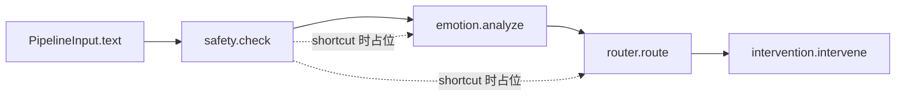

# 干预闭环模块：需求对照与跨模块集成说明

本文以 **干预闭环** 为例，说明当前代码相对业务目标的完成度，以及 **安全 / 情感 / 路由** 如何把 JSON 传入干预模块；并给出 HTTP、Python、端点串联样例。

---

## 1. 需求对照（架构方案 vs 当前仓库）

以下对照「情绪安抚链 / 知识检索链 / 危机干预 / 输出处理」等方案描述与仓库实现。

| 能力 | 方案预期 | 当前实现状态 | 代码位置 |
|------|-----------|----------------|----------|
| 契约（输入/输出 JSON） | `InterventionRequest` → `InterventionResult` | **已实现** | `schemas/contracts/v1.py` |
| 按 `route` 分支（comfort / knowledge / crisis） | 不同链路与资源 | **未实现**：Mock/Stub 仅按 `route` 换前缀与 `emergency_triggered` 布尔，无真正三分支 | `modules/intervention/mock.py`、`stub.py` |
| 情绪安抚链（LLM + CoT） | 共情→分析→建议 | **未接入**：未调用 `TherapyChain` / LLM | — |
| 知识检索链（RAG） | v3.3: QR → Union(Chroma+BM25) → gte-rerank-v2 → LLM | **✅ 已实现** | `core/rag/` `modules/intervention/rag/` |
| 危机干预 | 固定脚本 + `emergency_notify()` | **未实现**：无脚本库、无通知函数 | — |
| 结构化解析 | 从 LLM 输出拆 empathy、suggestion、action_items | **仅占位字段**：Mock 写死字符串 | `InterventionResult` |
| TTS | Edge-TTS / VITS | **不在干预契约内**：多模态另有 `multimodal/tts.py`，流水线未把 TTS 写入 `InterventionResult` | `multimodal/tts.py` |
| HTTP 独立调试 | 单模块联调 | **已实现** | `POST /api/v1/modules/intervention/run` |
| 端到端串联 | 安全→情感→路由→干预 | **已实现**（干预仍为 Mock/Stub） | `pipeline/orchestrator.py`、`POST /api/v1/pipeline/run` |

**结论**：干预闭环在工程上已完成 **边界契约 + 编排接线 + Mock/Stub**，便于并行开发；与产品方案相比，**业务闭环（三分支干预、LLM/RAG/危机脚本、紧急通知）尚未实现**。遗留的完整心理咨询对话能力仍在 **`POST /api/v1/chat`** → `core/chain/therapy_chain.py`，尚未映射到 `InterventionRequest`。

---

## 2. 上游如何把数据交给干预（数据流）

编排器在组装 `InterventionRequest` 时约定如下（见 `pipeline/orchestrator.py`）：

| 字段 | 来源模块 | 含义 |
|------|-----------|------|
| `user_text` | 流水线入口 `PipelineInput.text` | 用户文本（可先经过 ASR） |
| `session_id` | `PipelineInput.session_id` | 可选会话 ID |
| `safety` | **输入与安全过滤** | `SafetyCheckResult.model_dump()` |
| `emotion` | **情感分析**（或安全短路时的占位） | `EmotionTags.model_dump()` |
| `route` | **智能路由**（或安全短路时的危机占位） | `RouteDecision.model_dump()` |

干预实现 **只应依赖契约字段**，不应反向 import 上游模块类，便于替换为真实 LLM/RAG。



安全短路（`blocked` 或 `level >= EMERGENCY_SAFETY_LEVEL`）时：编排器直接构造占位 `emotion` / `route`（危机），再调用 **同一套** `intervention.intervene`，便于前端始终解析同一 JSON 形状。

---

## 3. 预制干预测试数据（可直接 POST）

下列文件均在 `schemas/contracts/samples/`，均为合法 `InterventionRequest`，启动 uvicorn 后可用 `curl -d @文件` 调用 `POST /api/v1/modules/intervention/run`。

| 文件 | 用途说明 |
|------|-----------|
| `intervention_case_comfort.json` | `route=comfort`，一般情绪支持场景 |
| `intervention_case_knowledge.json` | `route=knowledge`，偏知识/指南类话术前置 |
| `intervention_case_crisis.json` | `route=crisis`，高危占位字段（**仅联调用**，非真实处置） |
| `intervention_case_minimal.json` | 最少字段冒烟测试 |

默认 `MOCK_INTERVENTION=true` 时，响应前缀为 `[mock-comfort]` / `[mock-knowledge]` / `[mock-crisis]`，`emergency_triggered` 在 crisis 场景为 `true`（见 `MockInterventionService`）。

---

## 4. 集成样例

### 4.1 仅测干预模块（HTTP）

上游模块可先各自调用得到 JSON，再手工拼 `InterventionRequest`（字段与 `schemas/contracts/samples/intervention_request.json` 一致）。

```bash
curl -s -X POST "http://localhost:8000/api/v1/modules/intervention/run" ^
  -H "Content-Type: application/json" ^
  -d "@schemas/contracts/samples/intervention_case_comfort.json"
```

其它用例把文件名换成 `intervention_case_knowledge.json`、`intervention_case_crisis.json` 等即可。

默认 `MOCK_INTERVENTION=true` 时使用 `MockInterventionService`。在 `.env` 或环境中设置 `MOCK_INTERVENTION=false` 并 **重启服务** 后使用 `StubInterventionService`。

### 4.2 端到端（四模块 + 干预）

```bash
curl -s -X POST "http://localhost:8000/api/v1/pipeline/run" ^
  -H "Content-Type: application/json" ^
  -d "{\"contract_version\":\"1.0\",\"text\":\"最近压力很大，睡不着。\",\"session_id\":\"sess-1\"}"
```

响应中 **`intervention` 键** 即为干预模块输出（dict），与 `InterventionResult` 一致。

### 4.3 Python：在代码中调用编排（单测或脚本）

```python
from pipeline.orchestrator import run_pipeline
from schemas.contracts import PipelineInput

out = run_pipeline(PipelineInput(text="你好", session_id="s1"))
intervention_dict = out.intervention  # 与 InterventionResult 对应
reply = intervention_dict.get("reply", "")
```

### 4.4 Python：仅调用干预（自行组装上游 JSON）

```python
from modules.runtime import get_pipeline_services
from config.settings import settings
from schemas.contracts import InterventionRequest

svc = get_pipeline_services(settings)
result = svc.intervention.intervene(
    InterventionRequest(
        contract_version="1.0",
        user_text="示例",
        session_id="s1",
        route={"contract_version": "1.0", "route": "knowledge", "reason": "", "confidence": 1.0},
        emotion={"contract_version": "1.0", "primary_emotion": "neutral", "intensity": 0.5, "risk": 0.2, "modality_notes": {}},
        safety={"contract_version": "1.0", "level": 0, "blocked": False, "matched_terms": [], "meta": {}},
    )
)
```

---

## 5. 后续实现建议（与方案对齐）

1. **在 `modules/intervention/` 新增实现类**（例如 `TherapyInterventionService`）：内部按 `req.route["route"]` 分支：
   - `comfort`：调用现有 `TherapyChain` 或专用 CoT Prompt；
   - `knowledge`：检索 + LLM；
   - `crisis`：脚本 + `emergency_notify()`（可先日志模拟）。
2. **在 `modules/factory.py` 的 `get_intervention_service`** 中按配置返回新实现，替代 Stub。
3. **TTS**：若在闭环内返回音频，建议扩展契约（例如 `InterventionResult.meta["audio_base64"]`）或在网关层组合 `reply` + 独立 TTS API，并在本文档与 `parallel_module_io_samples.md` 中同步样例。

---

## 6. 相关文件索引

**调用链示意图（文本）**：[`modules/intervention/CALL_CHAIN.md`](../modules/intervention/CALL_CHAIN.md)。

| 文件 | 作用 |
|------|------|
| `schemas/contracts/v1.py` | `InterventionRequest` / `InterventionResult` |
| `schemas/contracts/samples/intervention_*.json` | 请求/响应样例 |
| `modules/intervention/mock.py` | 默认 Mock |
| `modules/intervention/stub.py` | Stub 占位 |
| `modules/ports.py` | `InterventionPort` 协议 |
| `api/routes/parallel_modules.py` | `POST .../intervention/run` |
| `pipeline/orchestrator.py` | 组装 `InterventionRequest` 并调用干预 |
| `core/chain/therapy_chain.py` | 遗留完整对话链，可适配进干预实现 |

更多跨模块 HTTP 一览见 [`parallel_module_io_samples.md`](parallel_module_io_samples.md)。
